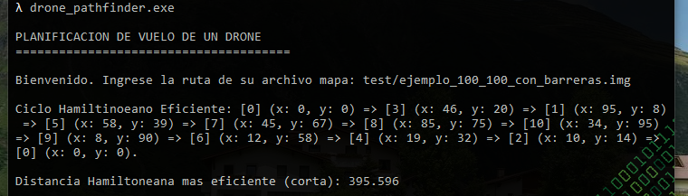

# drone_pathfinder (project #1)

Seeker of efficient Hamilton cycle, using breadth-first search algorithm.

### Demo

### Note

The code, as opposed to the globally recommended style, is in Spanish due to educational purposes, as a request from the AyED subject of our university.